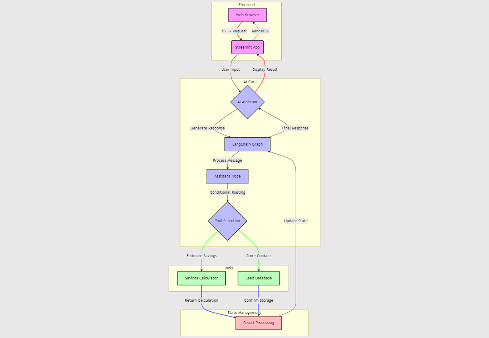

# Let's Build Lead Generation Startup Using AI Agents

Practical Guild for Building a Lead Generation Startup Powered by AI Agents
 
## Introduction

Picture this: You’re running a smart thermostat company, and you want to boost your sales. How do you do it? By harnessing the power of AI, of course! That’s exactly what we did at Aniket Electronics Ltd. (fictional) We built an AI assistant that not only chats with potential customers but also crunches numbers to show them how much they could save, then collect there contact details, save into database, so marketing team can use that. It’s like having a super-smart, never-tired salesperson working 24/7. Let me walk you through how we did it.

Full Article : [https://medium.com/@learn-simplified/lets-build-lead-generation-startup-using-ai-agents-e608c1efe7ba

This article is a behind-the-scenes look at how we created an AI-powered lead generator for our smart thermostats. We’re going to dive into the nuts and bolts of building a chatbot that can do more than just talk — it can calculate savings, store customer information, and guide potential buyers through the decision-making process.

You’ll see how we used tools like Streamlit for the user interface, LangChain for the AI conversation flow, and custom Python scripts for calculations and data storage. It’s a practical guide that shows you how to combine different technologies to create a powerful, automated sales tool.

## What's This Project About

This article breaks down the technical concepts of the research paper, "TAG: Semantic Search Over Structured & Unstructured Data", into simple language, making it accessible and exciting for readers unfamiliar with complex computer science.
The paper presents an innovative search system, TAG, that uses AI to enhance semantic searches over various types of data. TAG's primary goal is to help users navigate massive datasets, whether they're structured (like databases) or unstructured (like articles or reports), by introducing AI-driven tools that can understand the meaning behind the data.

## Why Work on It?

In today’s fast-paced business world, AI isn’t just a buzzword — it’s a game-changer. This article shows you, through our fictional company Aniket Electronics Ltd., how to implement AI in a practical, revenue-generating way.

You’ll learn how to create an AI system that can engage customers, provide personalized information, and capture leads — all automatically. Whether you’re in the smart home industry or not, the principles we cover can be applied to many businesses.

By the end of this article, you’ll have a roadmap for creating your own AI-powered lead generation system, potentially transforming how you attract and engage customers.

## Architecture



# Tutorial: Lets Build Lead Generation Startup Using AI Agents

## Prerequisites
- Python installed on your system.
- A basic understanding of virtual environments and command-line tools.

## Steps

1. **Virtual Environment Setup:**
   - Create a dedicated virtual environment for our project:
   
     ```bash
     python -m venv Lets_Build_Lead_Generation_Startup_Using_AI_Agents
     ```
   - Activate the environment:
   
     - Windows:
       ```bash
       Lets_Build_Lead_Generation_Startup_Using_AI_Agents\Scripts\activate
       ```
     - Unix/macOS:
       ```bash
       source Lets_Build_Lead_Generation_Startup_Using_AI_Agents/bin/activate
       ```
   
# Installation and Setup Guide

**Install Project Dependencies:**

Follow these steps to set up and run the 'Lets Build Lead Generation Startup Using AI Agents' project:

1. Navigate to your project directory:
   ```
   cd path/to/your/project
   ```
   This ensures you're in the correct location for the subsequent steps.

2. Install the required dependencies:
   ```
   pip install -r requirements.txt
   ```
   This command installs all the necessary Python packages listed in the requirements.txt file.


## Run - Lets Build Lead Generation Startup Using AI Agents

   ```bash 
        
      # Run Lets Build Lead Generation Startup Using AI Agents
      streamlit run app.py
      
   ```
